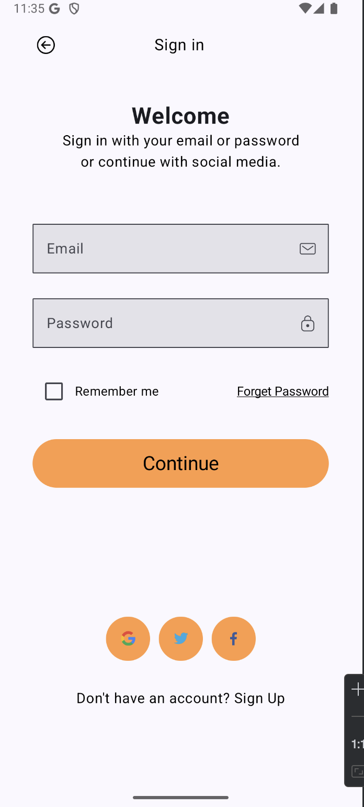
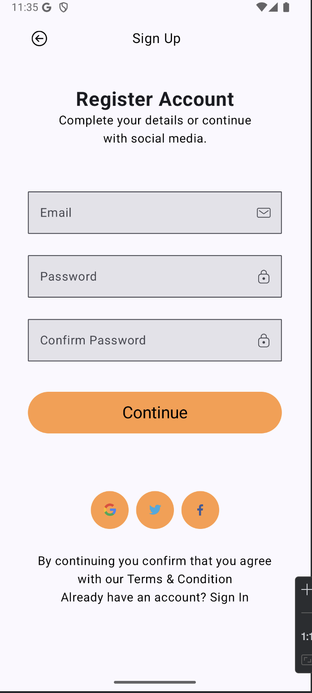
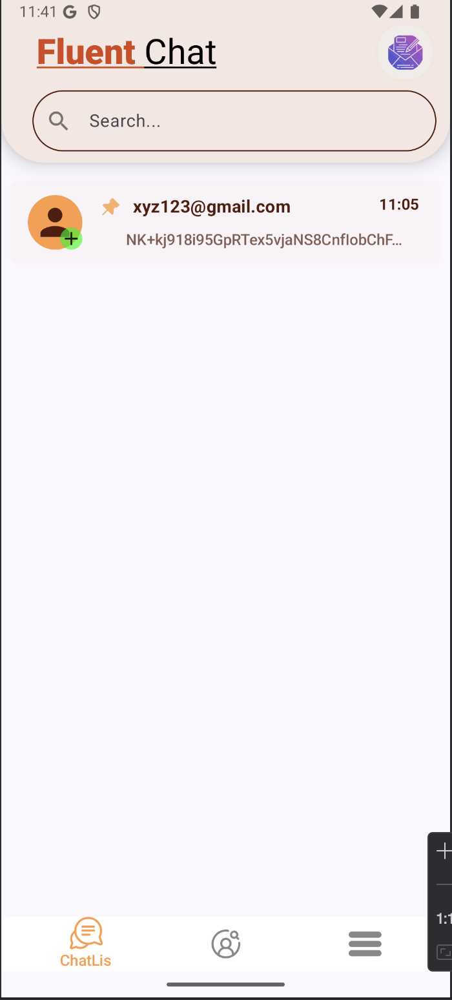
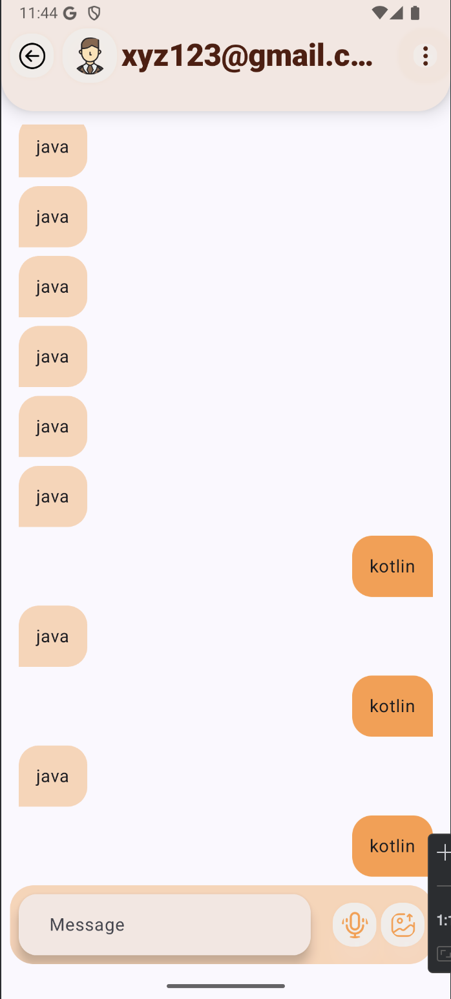

# 🗨️ Fluent - Secure Chat App with End-to-End Encryption

**Fluent** is a secure, real-time Android chat application built with Jetpack Compose and Kotlin. It features **end-to-end encrypted messaging**, **token-based authentication**, and **real-time communication** using **Ktor WebSockets** — all backed by a **FastAPI** server.

---

## ✨ Features

- 🔐 **End-to-End Encrypted Messaging (RSA via Android Keystore)**
- 🌐 **Real-Time Messaging** using Ktor WebSockets
- 🔑 **JWT Authentication** with Refresh Token Support
- 📱 **Jetpack Compose UI** (Material 3) with smooth UX
- 💬 **Message List & One-on-One Chat**
- 🧩 **Receiver-Side RSA Decryption via AndroidKeyStore**
- 🚀 **Message Streaming via WebSocket Flow Collector**
- 🎯 **Auto Key Generation + Storage via Android Keystore**
- ☁️ **EncryptedSharedPreferences for Secure Token Storage**
- 👤 **User Profiles & Sidebar Drawer**
- 🧭 **Custom Bottom Navigation with Slide Menu**
- 🧠 **MVVM + Clean Architecture**
- 🔧 **Dependency Injection via Koin**
- 📦 **Structured Modular Codebase**

---

## 📸 Screenshots

### 🔐 Login & Register
<p float="left">
  
  
</p>

### 💬 Chat List & Messages
<p float="left">
  
  
</p>

### 🔍 User Search
<p float="left">
  
</p>

---

## 🧱 Architecture Overview

```
presentation/
    ├── authentication/
    ├── chatList/
    ├── message/
    ├── splashOpening/
    ├── profile/
data/
    ├── dto/
    ├── remote/
    ├── mapper/
    ├── network/
domain/
    ├── models/
    ├── repository/
    ├── utility/
di/
    ├── Koin modules (network, encryption, viewmodel, repository)
```

- Jetpack Compose for UI
- Ktor HTTP/WebSocket for networking
- Android Keystore for RSA encryption
- StateFlow & SharedFlow for reactive state management

---

## 🔐 End-to-End Encryption Details

Each device generates an RSA keypair securely stored via the **Android Keystore System**.
- Messages are encrypted with the **recipient's public key**.
- Messages are decrypted using the **user’s private key** on-device.
- No plaintext is stored or transmitted at any point.
- Message decryption runs on a **dedicated coroutine scope** with `SupervisorJob` and `Mutex` for serialized, thread-safe access.

---

## 🧪 Real-Time Communication

- Messages are received over WebSocket (`Ktor client`)
- Decryption occurs on a background coroutine (`Dispatchers.Default`) using a `Mutex`
- Flow collector emits to the UI using `SharedFlow` to support real-time updates

---

## ⚙️ Tech Stack

- 🧬 **Kotlin** + **Jetpack Compose**
- 🌐 **Ktor HTTP/WebSocket Client**
- 🧩 **Koin** (DI)
- 🛡️ **EncryptedSharedPreferences**
- 🔐 **Android Keystore (RSA)**
- 🧠 **StateFlow + SharedFlow**
- 🖥️ **FastAPI (Python Backend)**
- 📜 **JWT Authentication (Access + Refresh Tokens)**

---

## 🧱 Improvements Made

- ✅ RSA decryption now safely runs in a background coroutine with a `Mutex` to avoid `IllegalBlockSizeException`
- ✅ Decryption bug fixed: messages now decrypt properly when received live (even without screen navigation)
- ✅ `SupervisorJob` added to isolate failure of decrypt jobs
- ✅ Scoped coroutine (`wsScope`) handles WebSocket lifecycle reliably
- ✅ WebSocket reconnect and lifecycle cleanup improved

---

## 🚧 Future Work

- [x] User Search API integration
- [x] Real-Time Message Sync using Flow
- [ ] Push Notifications (FCM integration)
- [ ] Typing Indicators
- [ ] Media Sharing (images, files, voice notes)
- [ ] Offline-first with Room DB
- [ ] Read receipts, chat status

---

## ▶️ How to Run

1. Clone this repo:
   ```bash
   git clone https://github.com/jishnu70/Fluent-Secure-E2E-Chat-App-Kotlin-Compose.git
   ```

2. Open in **Android Studio** (Kotlin 1.9+, Compose Compiler 1.5+)

3. Run the FastAPI backend
   > (Backend repo: [cryptalkfastapi](https://github.com/jishnu70/cryptalkfastapi))

4. Launch on a device or emulator (Android 8.0+ required)

---

## 🤝 Contributing

This project is built solo for now.  
Feel free to open issues, suggest improvements, or send PRs if you're passionate about privacy-first messaging apps.
